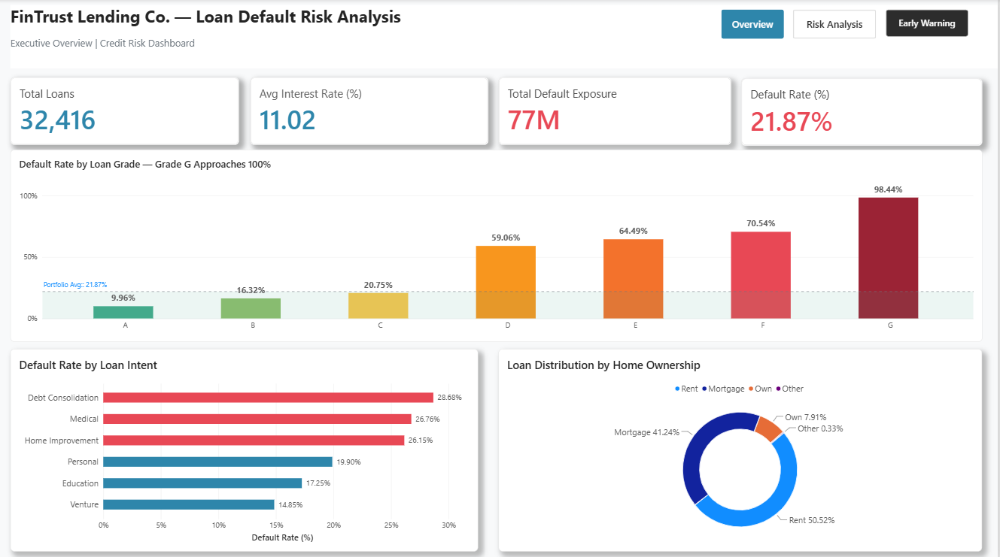
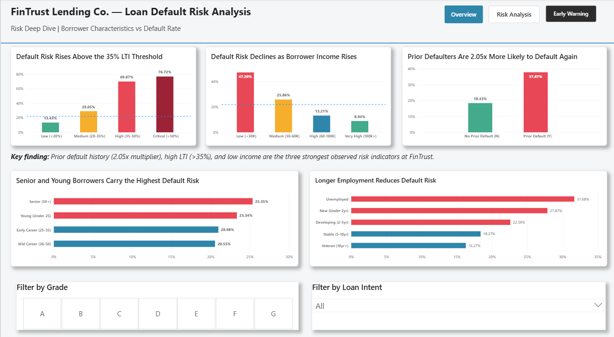
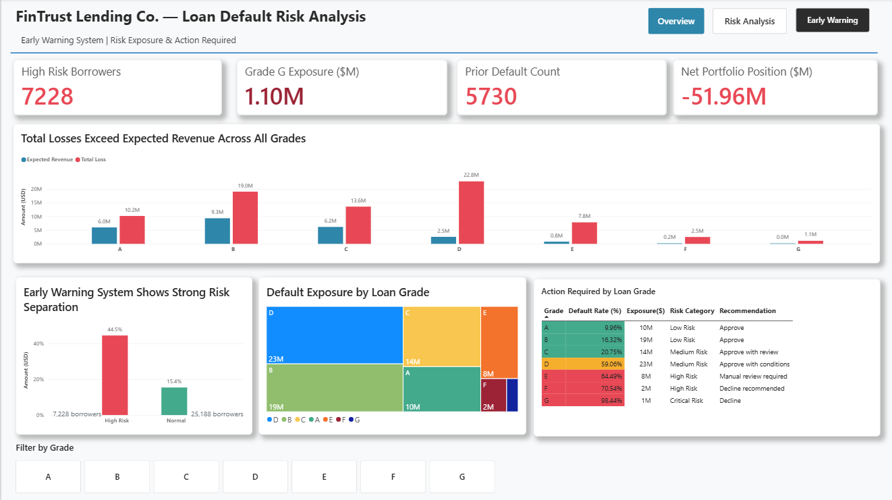
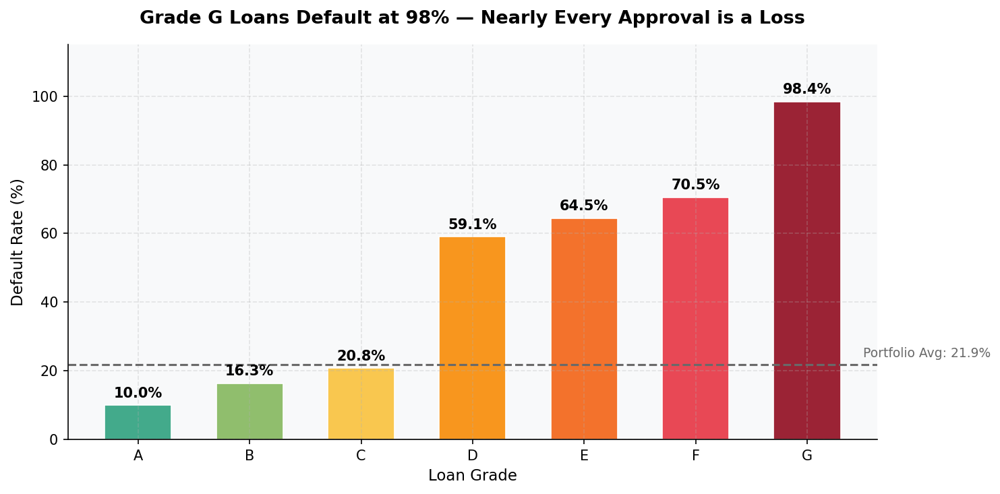
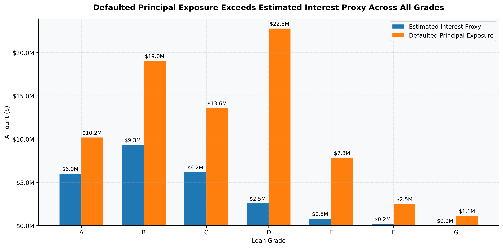
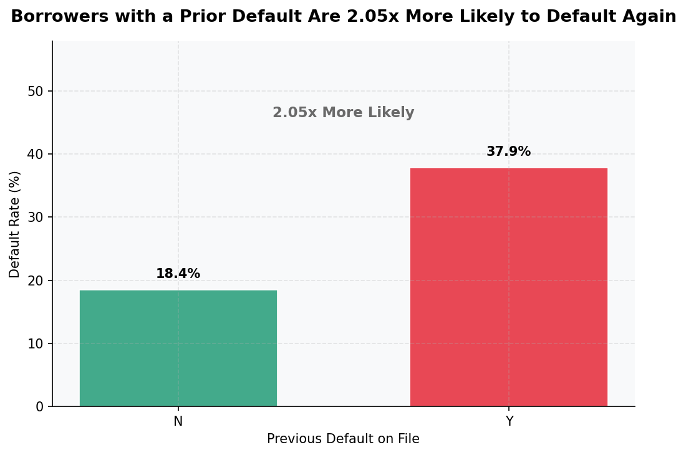

# Loan Default Risk Analysis & Early Warning System

> **Simulating real credit risk analytics for FinTrust Lending Co. — 
> a mid-size NBFC experiencing a 21.87% loan default rate, 
> 4 to 6x the NBFC sector average.**

---

## The Business Problem

FinTrust Lending Co. is losing money on nearly 1 in 5 loans approved.

- Default rate: **21.87%** vs industry average of **3–5%**
- Total defaults: **7,089 loans** out of 32,416
- Interest revenue from repaid loans: **$25M**
- Principal lost on defaulted loans: **$77M**
- **Net portfolio position: -$51.96M**

As the analyst, I was hired to find out why — and build a system 
to prevent it.

---

## Project Phases

Phase 1 → Business Understanding & Stakeholder Requirements
Phase 2 → Dataset Selection & Evaluation
Phase 3 → Data Dictionary & Column Analysis
Phase 4 → Data Cleaning (7 steps, documented)
Phase 5 → SQL Analysis (26 business queries)
Phase 6 → Python EDA (10 business-driven visualisations)
Phase 7 → Power BI Dashboard (3 interactive pages)
Phase 8 → Business Insights (8 executive findings)
Phase 9 → Executive Summary (CEO-level briefing)

---

## Key Findings

| # | Finding | Evidence | Action |
|----------|----------|----------|----------|
| 1 | Grade G loans are near-certain losses | 98.44% default rate | Suspend immediately |
| 2 | Prior defaulters 2x more likely to default again | 37.87% vs 18.43% | Mandatory review trigger |
| 3 | Debt Consolidation highest risk intent | 28.68% default rate | Stricter approval criteria |
| 4 | DTI above 35% sharply increases default | 69.87% in High tier | Hard ceiling enforcement |
| 5 | Grade D causes largest absolute loss | $23M exposure | Volume cap required |
| 6 | Grades F and G are loss-making | $0.2M revenue vs $3.6M loss | Discontinue or reprice |
| 7 | Early Warning System validated | 44.5% vs 15.4% default rate | Operationalise immediately |
| 8 | Net portfolio position is -$51.96M | $25M revenue vs $77M loss | Immediate policy reform |

---

## Dashboard

3-page interactive Power BI dashboard built for the CRO.

### Page 1 — Executive Overview


### Page 2 — Risk Deep Dive


### Page 3 — Early Warning System


---

## EDA Highlights

### Default Rate by Loan Grade


### Revenue vs Loss by Grade


### Prior Default Impact


---

## Tools Used

| Tool | Version | Purpose |
|---|---|---|
| Python | 3.x | Data cleaning and EDA |
| Pandas | Latest | Data manipulation |
| NumPy | Latest | Statistical calculations |
| Matplotlib + Seaborn | Latest | Data visualisation |
| MySQL | 8.0 | SQL analysis |
| Power BI Desktop | Latest | Interactive dashboard |
| Google Colab | — | Development environment |
| GitHub | — | Version control |

---

## Repository Structure


```text
loan-default-risk-analysis/
│
├── data/
│   ├── raw/
│   │   └── credit_risk_dataset.csv          # Original dataset
│   └── cleaned/
│       └── credit_risk_cleaned.csv          # Cleaned — 32,416 rows
│
├── notebooks/
│   └── Loan_default_risk_analysis.ipynb     # Full analysis notebook
│
├── sql/
│   ├── setup.sql                            # Database setup
│   ├── reference_tables.sql                 # Risk scoring tables
│   └── queries.sql                          # 26 business queries
│
├── dashboard/
│   ├── FinTrust_LoanDefaultRisk_Dashboard.pbix
│   └── screenshots/                         # All chart and dashboard images
│
├── reports/
│   ├── sql_findings.md                      # 10 SQL findings
│   ├── eda_findings.md                      # 10 EDA findings
│   ├── business_insights.md                 # 8 executive insights
│   └── executive_summary.md                 # CEO briefing
│
└── cleaning_log.md                          # Cleaning decisions log
```

## Dataset

| Field | Detail |
|---|---|
| Source | Credit Risk Dataset — Kaggle (Laotse) |
| License | CC0 Public Domain |
| Raw rows | 32,581 |
| Cleaned rows | 32,416 |
| Columns | 12 original + 1 engineered |
| Target variable | loan_status (1 = default, 0 = repaid) |
| Default rate | 21.87% |

---

## SQL Analysis Highlights

26 queries across 5 categories:

```sql
-- Window function example: running cumulative exposure
SELECT
    loan_grade,
    SUM(loan_amnt)                          AS grade_exposure,
    SUM(SUM(loan_amnt))
        OVER (ORDER BY loan_grade ASC)      AS cumulative_exposure
FROM credit_risk
WHERE loan_status = 1
GROUP BY loan_grade
ORDER BY loan_grade;
```

**Categories covered:**
- Basic aggregations and GROUP BY
- CASE WHEN risk classification
- Multi-table JOINs with reference tables
- CTEs for multi-step business logic
- Window functions — RANK, ROW_NUMBER, NTILE, running totals

Full query file: [sql/queries.sql](sql/queries.sql)

---

## Data Cleaning Summary

| Step | Issue | Action | Rows affected |
|---|---|---|---|
| 1 | Duplicate rows | Removed | 165 |
| 2 | Impossible ages (max 144) | Capped at 80 | Multiple |
| 3 | Impossible employment length | Capped at (age - 16) | 740 |
| 4 | Missing employment length | Filled 0 + binary flag | 887 |
| 5 | Missing interest rate | Group median by grade | 3,116 |
| 6 | Income outliers (max $6M) | IQR cap at $140,232 | Multiple |
| 7 | Categorical inconsistencies | Strip + uppercase | All cat cols |

Full log: [cleaning_log.md](cleaning_log.md)

---

## Business Recommendations

**Immediate actions:**
- Suspend all Grade G loan approvals — 98.44% default rate
- Treat prior default flag as automatic escalation trigger
- Enforce 35% DTI as hard ceiling — no exceptions below board level

**30-day actions:**
- Apply intent-specific approval criteria for Debt Consolidation
- Operationalise composite risk flag in approval workflow

**60-day actions:**
- Cap Grade D volume at 15% of monthly approvals
- Review Grade F pricing — currently loss-making

**Projected impact:** $25–30M reduction in annual default losses

Full report: [reports/executive_summary.md](reports/executive_summary.md)

**Compliance note:** Any hard cutoffs based on the criteria above (grade, 
DTI, prior default) should be reviewed against fair-lending regulations 
before implementation, since risk variables can correlate with protected 
characteristics even when not directly using them.

---

## Limitations of This Analysis

- **No loan-vintage or date field.** The dataset is a single snapshot, so no 
  trend, seasonality, or cohort drift analysis was possible. All findings 
  describe the historical portfolio as a whole, not how risk is evolving.
- **No loan-term field.** Interest revenue is calculated as one year of 
  simple interest (loan_amnt × rate), not total revenue over the life of 
  the loan. This is a conservative, first-year view — see the Methodology 
  note in the financial analysis section.
- **Self-reported income**, with no independent verification field.
- **Single dataset source** (Kaggle, CC0). Findings should be validated 
  against FinTrust's real portfolio before any policy change is implemented.

  ---

  ## What I'd Analyze With More Data

- **Time-series default drift** — if loan origination date were available, 
  track whether default rates are worsening or improving by cohort.
- **Macro overlay** — unemployment rate, interest rate environment, or 
  regional economic indicators at time of origination.
- **Bureau score** (if available) alongside internal grade, to test whether 
  FinTrust's grading model adds predictive power beyond a raw credit score.
- **Recovery/collections data** — this analysis assumes 0% recovery on 
  defaults (stated as a conservative assumption); real LGD (loss given 
  default) is rarely 100%, and modeling recovery would materially change 
  the net loss figures.

  ---

## About

**Analyst:** Telukala Snuhith Reddy  
**Degree:** B.Tech Computer Science — SR University, Warangal (2023–2027)  
**Email:** snuhithreddy2005@gmail.com  


---

*This project simulates a real consulting engagement. 
Dataset: Credit Risk Dataset by Laotse — Kaggle (CC0 Public Domain).
All company names are fictional.*
